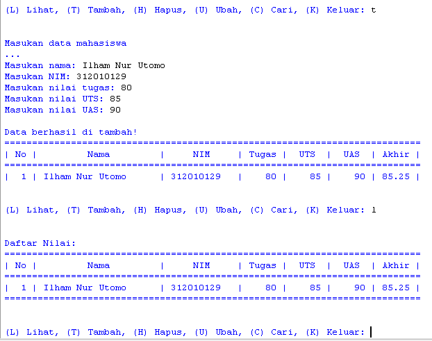
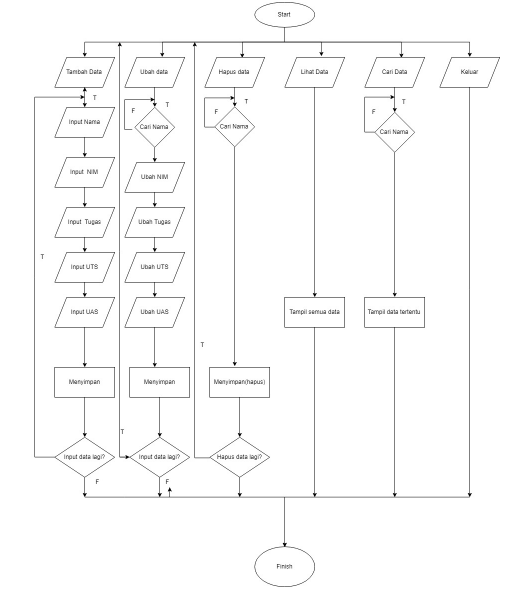

# DAFTAR TUGAS

<table border="2" cellpading="10">
  <tr>
    <td><b>Pertemuan 4</b></td>
    <td>Latihan VCS</td>
    <td><a href="https://github.com/IlhamLamp/LatihanVCS">Klik disini</td>
  </tr>
  <tr>
    <td><b>Pertemuan 5</b></td>
    <td>Program Biodata</td>
    <td><a href="https://github.com/IlhamLamp/Program-menginputkan-biodata">Klik disini</td>
  </tr>
  <tr>
    <td><b>Pertemuan 6</b></td>
    <td>Lab1 dan 2</td>
    <td><a href="https://github.com/IlhamLamp/ProjectPraktikum">Klik disini</td>
  </tr>
  <tr>
    <td><b>Pertemuan 7</b></td>
    <td>Lab3</td>
    <td><a href="https://github.com/IlhamLamp/Lab3">Klik disini</td>
  </tr>
  <tr>
    <td></td>
    <td>Labspy02</td>
    <td><a href="https://github.com/IlhamLamp/labspy02">Klik disini</td>
  </tr>
  <tr>
    <td></td>
    <td>Labpy03</td>
    <td><a href="https://github.com/IlhamLamp/labpy03">Klik disini</td>
  </tr>
  <tr>
    <td><b>Pertemuan 9</b></td>
    <td>Lab 4</td>
    <td><a href="https://github.com/IlhamLamp/Lab-4">Klik disini</td>
  </tr>
  <tr>
    <td></td>
    <td>Lab 5</td>
    <td><a href="https://github.com/IlhamLamp/Lab-5">Klik disini</td>
  </tr>
</table>

## Latihan

### Soal

### Jawaban

  - Buka text editor, kemudian salin kode berikut:

        1     daftar_kontak = {}
        2  
        3     #Tampilkan kontaknya Ari
        4     daftar_kontak['Ari'] = '081267888'
        5     print("# Nama   | Nomor telepon")
        6     print("# ========================")
        7     for i in daftar_kontak.items():
        8         print("# {0:6} |".format(i[0]),i[1])
        9     print('+------------_-------------+\n')
        10
        11    #Dina
        12    daftar_kontak['Dina'] = '087677776'
        13
        14    #riko
        15    daftar_kontak['Riko'] = '087654544'
        16    daftar_kontak['Ari'] = '081267888'
        17    print("# Nama   | Nomor telepon")
        18    print("# ========================")
        19    for i in daftar_kontak.items():
        20    print("# {0:6} |".format(i[0]),i[1])
        21    print('+------------_-------------+\n')
        22
        23    #ubah kontak dina
        24    daftar_kontak['Dina'] = '088999776'
        25    daftar_kontak['Ari'] = '081267888'
        26    print("# Nama   | Nomor telepon")
        27    print("# ========================")
        28    for i in daftar_kontak.items():
        29        print("# {0:6} |".format(i[0]),i[1])
        30    print('+------------_-------------+\n')
        31
        32    #tampilkan semua nama
        33    for nama in daftar_kontak.keys():
        34        print(nama)
        35    print('+------------_-------------+\n')
        36
        37    #tampilkan semua nomor
        38    for nomor in daftar_kontak.values():
        39        print(nomor)
        40    print('+------------_-------------+\n')
        41
        42    #tampilkan daftar nama dan nomor
        43    print("# Nama   | Nomor telepon")
        44    print("# ========================")
        45    for i in daftar_kontak.items():
        46        print("# {0:6} |".format(i[0]),i[1])
        47    print('+------------_-------------+\n')
        48
        49    #hapus kontak dina
        50    del daftar_kontak['Dina']
        51    print("# Nama   | Nomor telepon")
        52    print("# ========================")
        53    for i in daftar_kontak.items():
        54        print("# {0:6} |".format(i[0]),i[1])

  - Simpan dengan nama `latihan.py` lalu jalankan, maka akan menampilkan output berikut:

    - **Tampilkan kontaknya Ari**

      

    - **Tambah kontak baru dengan nama Riko, nomor 087654544**

      

    - **Ubah kontak Dina dengan nomor baru 088999776**

      

    - **Tampilkan semua Nama**

      

    - **Tampilkan semua Nomor**

      

    - **Tampilkan daftar Nama dan nomornya**

      

    - **Hapus kontak Dina**

      

## Tugas Praktikum

### Soal

### Jawaban

  - Buka text editor, kemudian salin kode berikut:

        print("\n=======================")
        print("| PROGRAM INPUT NILAI |")
        print("=======================")

        data = {}

        while(True):
            print("\n")
            menu = input("(L) Lihat, (T) Tambah, (H) Hapus, (U) Ubah, (C) Cari, (K) Keluar: ")
            print("\n")

            # Keluar
            if menu.lower() == 'k':
                break

            # Lihat
            elif menu.lower() == 'l':
                print("Daftar Nilai:")
                print("===========================================================================")
                print("| No |         Nama         |     NIM     | Tugas |  UTS  |  UAS  | Akhir |")
                print("===========================================================================")
                no = 1
                if len(data.values()) > 0:
                    for tabel in data.values():
                        print("| {0:2} | {1:20} | {2:11} | {3:5} | {4:5} | {5:5} | {6:5.2f} |".format
                              (no, tabel[0],
                               tabel[1], tabel[2],
                               tabel[3], tabel[4], tabel[5]))
                        no += 1
                else:
                    print("|",'{:^71}'.format("TIDAK ADA DATA"),"|")
                print("===========================================================================")

            # Tambah
            elif menu.lower() == 't':
                print("Masukan data mahasiswa")
                print("...")
                nama = input("Masukan nama: ")
                nim = input("Masukan NIM: ")
                nilai_tugas = int(input("Masukan nilai tugas: "))
                nilai_uts = int(input("Masukan nilai UTS: "))
                nilai_uas = int(input("Masukan nilai UAS: "))
                nilai_akhir = (nilai_tugas)*30/100 + (nilai_uts)*35/100 + (nilai_uas)*35/100
                data[nama] = [nama, nim, nilai_tugas, nilai_uts, nilai_uas, nilai_akhir]
                print('\nData berhasil di tambah!')
                print("===========================================================================")
                print("| No |         Nama         |     NIM     | Tugas |  UTS  |  UAS  | Akhir |")
                print("===========================================================================")
                no = 1
                for tabel in data.values():
                    print("| {0:2} | {1:20} | {2:11} | {3:5} | {4:5} | {5:5} | {6:5.2f} |".format
                          (no, tabel[0],
                           tabel[1], tabel[2],
                           tabel[3], tabel[4], tabel[5]))
                    no += 1

            # Ubah
            elif menu.lower() == 'u':
                nama = input("Masukan nama untuk mengubah data: ")
                if nama in data.keys():
                    print("Mau mengubah apa?")
                    sub_data = input("(Semua), (NIM), (Tugas), (UTS), (UAS) : ")
                    if sub_data.lower() == "semua":
                        print("==========================")
                        print("Ubah data {}.".format(nama))
                        print("==========================")
                        data[nama][1] = input("Ubah NIM:")
                        data[nama][2] = int(input("Ubah Nilai Tugas: "))
                        data[nama][3] = int(input("Ubah Nilai UTS: "))
                        data[nama][4] = int(input("Ubah Nilai UAS: "))
                        data[nama][5] = data[nama][2]*30/100 + data[nama][3]*35/100 + data[nama][4]*35/100
                        print("\nBerhasil ubah data!")
                        print("===========================================================================")
                        print("| No |         Nama         |     NIM     | Tugas |  UTS  |  UAS  | Akhir |")
                        print("===========================================================================")
                        no = 1
                        for tabel in data.values():
                            print("| {0:2} | {1:20} | {2:11} | {3:5} | {4:5} | {5:5} | {6:5.2f} |".format
                                (no, tabel[0],
                                tabel[1], tabel[2],
                                tabel[3], tabel[4], tabel[5]))
                            no += 1
                    elif sub_data.lower() == "nim":
                        data[nama][1] = input("NIM:")
                        print('Data berhasil di ubah!')
                    elif sub_data.lower() == "tugas":
                        data[nama][2] = int(input("Nilai Tugas: "))
                        data[nama][5] = data[nama][2]*30/100 + data[nama][3]*35/100 + data[nama][4]*35/100
                        print('Data berhasil di ubah!')
                    elif sub_data.lower() == "uts":
                        data[nama][3] = int(input("Nilai UTS: "))
                        data[nama][5] = data[nama][2]*30/100 + data[nama][3]*35/100 + data[nama][4]*35/100
                        print('Data berhasil di ubah!')
                    elif sub_data.lower() == "uas":
                        data[nama][4] = int(input("Nilai UAS: "))
                        data[nama][5] = data[nama][2]*30/100 + data[nama][3]*35/100 + data[nama][4]*35/100
                        print('Data berhasil di ubah!')
                    else:
                        print("menu tidak ditemukan.")

                else:
                    print("'{}' tidak ditemukan.".format(nama))

            # Cari
            elif menu.lower() == 'c':
                print("Mencari data: ")
                print("=================================================")
                nama = input("Masukan nama untuk mencari data: ")
                if nama in data.keys():
                    print('\nHasil')
                    print("Nama: {0}\nNIM : {1}\nNilai Tugas: {2}\nUTS: {3}\nUAS: {4}\nNilai akhir: {5:.2f}"
                          .format(nama, data[nama][1],
                                        data[nama][2], data[nama][3],
                                        data[nama][4], data[nama][5]))
                else:
                    print("'{}' tidak ditemukan.".format(nama))

            # Hapus
            elif menu.lower() == 'h':
                nama = input("Masukan nama untuk menghapus data : ")
                if nama in data.keys():
                    del data[nama]
                    print("sub_data '{}' berhasil dihapus.".format(nama))
                else:
                    print("'{}' tidak ditemukan.".format(nama))

            else:
                print("Keyword yang anda masukkan salah")

  - Simpan dengan nama `lab5.py` lalu jalankan, maka akan menampilkan output berikut:

    - **Jika data kosong**

      

    - **Menambah data**

      

      

    - **Mencari data**

      

    - **Mengubah data**

      

    - **Menghapus data**

      

### Penjelasan
  - Pertama membuat dictionary dengan nama `data`.

  - `While(True)`, sebagai perulangan ketika program yang dijalankan dalam kondisi benar. Kemudian di `menu` terdapat pilihan `k`/ _Keluar_, pada baris inilah program akan berhenti berulang karna ada perintah `break`.

  - Terdapat 6 pilihan pada menu, yaitu

  - **T (tambah)**, untuk menambahkan nama, nisn, nilai tugas, uts, dan uas ke dictionary `data`.

  - **L (lihat)**, untuk melihat/ menampilkan informasi yang ada di `data` seperti nama, nisn, nilai tugas, uts, uas dan nilai akhir. Jika di dalam `data` tidak ada informasi, maka akan menampilkan kalimat `TIDAK ADA DATA`.

  - **U (ubah)**, untuk mengubah nilai-nilai yang ada di dalam `data`. Kemudian akan disimpan.

  - **C (cari)**, untuk mencari informasi mahasiswa. Jika kata kunci tidak sesuai, maka akan menampilkan kalimat `(Nama mahasiswa) TIDAK DITEMUKAN`.

  - **H (hapus)**, untuk menghapus `nama` mahasiswa yang dipilih beserta nim, dan yang lainnya.

  - **K (keluar)**, untuk memberhentikan program.

### Flowchart

